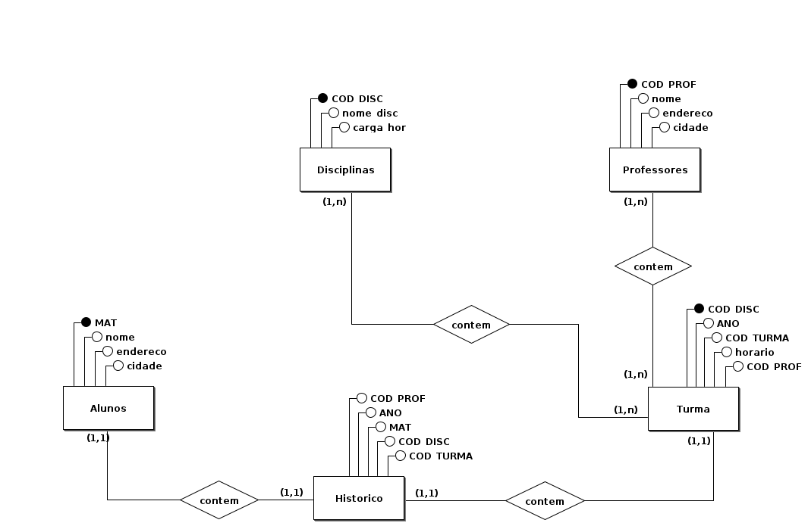

# Prova de banco de dados

Integrantes:

- Pedro Lucas
- Vitor Hugo

## Modelo Conceitual

  

  
## Modelo Lógico 

  

# Descrição das tabelas do modelo Lógico

## Tabela <i>alunos</i>
A tabela <i>alunos</i> se refere aos dados dos alunos cadastrados nesta escola.
Nela possuímos os atributos/colunas:
- MAT: matricula do aluno/chave primária da tabela
- nome: nome do aluno cadastrado
- endereco: endereço do aluno cadastrado nesta escola
- cidade: informação importante referente ao aluno e onde se localiza sua residencia

## Tabela <i>turma</i>
A table <i>turma</i> se refere a turma em que as disciplinas e professores foram atribuidos a ela para 
Nela possuímos os atributos/colunas:
- COD_TURMA: deveria ser a chave primária(ouve erros nesta tabela)
- COD_DISC: chave estrangeira
- COD_PROF: chave estrangeira
- ano: ano em que a turma está
- horario: harario em que cada turma irá ter, referente as aulas

## Tabela <i>disciplinas</i>
A tabela <i>disciplinas</i> se refere as disciplinas em que a turma que o aluno foi atribuido irá ter.
Nela possuímos os atributos/colunas:
- COD_DISC: chave primária da tabela
- nome_disc: o nome das disciplinas
- carga_har: a carga horaria em que cada disciplina irá ter

## Tabela <i>professores</i>
A tabela <i>professores</i> se refere ao/s professor/es que irá ter em cada turma
Nela possuímos os atributos/colunas:
-
-

## Tabela <i>historico</i>

## Licença
Esse código está no domínio público, porque nós não queremos ter responsabilidade nenhuma por ele.

Se vira

## Inspirações

https://github.com/caffeine-squad/modelagem_bd
